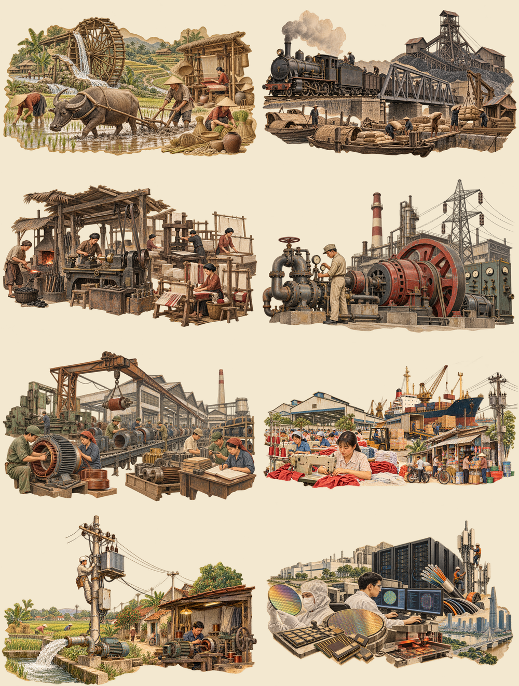

# History Bridge assets

Generated with built-in `image_gen` on 2026-10-02. Complete prompt set: [prompts.json](prompts.json). Tool-returned file provenance: [generated-assets.json](generated-assets.json). Original files: `originals/`. Responsive WebP outputs: `../../public/images/history/`.

Each period has one isolated main reconstruction and one monochrome panorama. Illustrations are marked as reconstructions in the experience; they are not documentary evidence. No supplied reference-image pixels are reused. Native main outputs are 1536×1024; transparent-margin cropping and 2048px zoom resampling retain the composition but do not create native detail. The high-resolution copies are lazy.

Recreate the optimized assets with `node scripts/prepare-history-assets.mjs`, using the bundled Sharp runtime. No new dependency is installed. The script copies original outputs, trims transparent margins, preserves alpha and exports WebP. Preserve the original PNGs for future art revisions.

